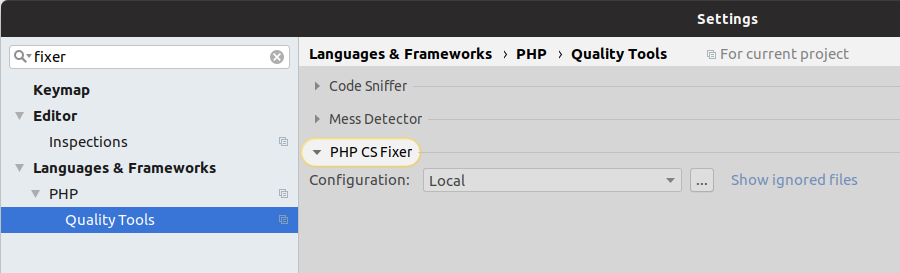
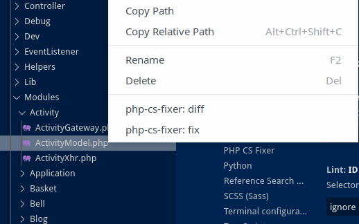

## php Code style

We use php-cs-fixer to format the code style.
The aim is to make it use the same style as phpstorm does by default.
The fixer is based on the @Symfony ruleset, with a few changes.

To format all files, you can run:

```
vendor/bin/php-cs-fixer fix --show-progress=estimating --verbose
```

For convenience, you can and should add the code style fix as a pre-commit hook.
So you will never commit/push any PHP code that does not follow the code style rules.

There are two possibilities:
- [Using local PHP](#using-local-php)
- [Using Docker PHP](#using-docker-php)
- Using your IDE:
  - [PHPstorm](#using-phpstorm)
  - [VS Code](#using-vscode)

### Using local PHP

When PHP >= 7.0 is installed locally and the vendor folder is in place (by having used the automated tests or the dev environment), you can use your computers PHP to check/fix the codestyle, as this is the fastest option:

```
./scripts/fix-codestyle-local
```

Adding this to `.git/hooks/pre-commit` could look like that:

```
#!/bin/sh
HASH_BEFORE=$(git diff | sha1sum)
./scripts/fix-codestyle-local
# or use
# vendor/bin/php-cs-fixer fix --show-progress=estimating --verbose
# or
# ./scripts/fix
# if the -local script throws an error
HASH_AFTER=$(git diff | sha1sum)

if test "$HASH_AFTER" != "$HASH_BEFORE" ; then
  echo "PHP Codestyle was fixed. Please read the changes and retry commit."
  exit 1;
fi
```

### Using docker PHP

Executing the following script will use the dev environment to run the codestyle check.
As it currently always runs a new container using docker-compose, it will take some seconds to execute:

```
./scripts/fix
```

### Using PHPstorm

If you happen to use PHPstorm you can add `php-cs-fixer` to those settings as well:
<div align="center"></div>
<div align="center"></div>

### Using VSCode

You can use the [php cs fixer](https://marketplace.visualstudio.com/items?itemName=junstyle.php-cs-fixer) Extension. It should work right after a restart. To fix a file right click on it and select

<div align="center"></div>

You can even configure it to fix your code style after saving a file under: **Settings>PHP CS Fixer>Execute PHP CS Fixer on save** for not commiting any non-fixed code.

*Note: You need PHP installed locally for this.*

### Editorconfig

Depending on your editor you need to do nothing or install or configure a plugin to use the file `.editorconfig`. Please refer to the section about [Code style](codestyle.md).
