## Release "Cranberry", October 2020 - English, highly abridged Version:

Main features and important changes:
- We started to work on building a voting tool! Reach out to our [beta-testing workgroup "Abstimmungen - Betatest"](https://foodsharing.de/?page=groups&p=392) to help with polishing it for everyone :)
- When store managers remove (confirmed and unconfirmed) foodsavers from pickup slots, we now generate a chat message where the reasons can be explained.
- Dashboard updates are now limited to the last entry for events, buddy walls and foodshare-points.
- We fixed a problem with disappearing store traffic lights and long store names in Firefox

If you're interested in more elaborate English release notes, [please contact us](https://foodsharing.de/?page=content&sub=contact). We'll be glad to regularly provide an English version as well, if you help us translate or proofread! (Or other languages, if you're willing.)

---

# Release "Cranberry" Oktober 2020 - Deutsche Version

# foodsharing im Browser

Mit dem Release der neuen Software-Version sind weitere Funktionen verfügbar. Dazu haben wir [Notizen im Changelog](https://foodsharing.de/?page=content&sub=changelog) gesichtet, diskutiert und formuliert. Nun fassen wir bündig zusammen, was sich für dich ändert, wenn du Foodsharer\*in oder Foodsaver\*in, BV oder BOT bist.

Unter der Haube wurden zudem noch viele weitere Anpassungen vorgenommen, die zwar selten bemerkt werden, aber dennoch zur kontinuierlichen Wartung und Modernisierung notwendig sind und dafür sorgen, dass foodsharing stabil und lauffähig bleibt.

Aktuell ist unser ehrenamtliches Team sehr ausgelastet und freut sich daher stets über Unterstützung!
Schreib uns bei Interesse einfach eine Nachricht über das [Support-Portal](https://foodsharing.de/?page=content&sub=contact), dann nehmen wir Kontakt mit dir auf. Du kannst diese Info auch gern an potentiell Interessierte weiterleiten!

## Foodsharer\*in und Foodsaver\*in

Zu Events sowie Posts auf Pinnwänden von Fairteilern und Bekannten wird jetzt auf dem Dashboard nur das jeweils aktuellste Update angezeigt (so wie auch für Themen im Forum). (Referenz: !1694)

Die farbige Ampel-Anzeige in der Betriebsliste wurde in manchen Browsern bei langen Betriebsnamen ausgeblendet. Das führte dazu, dass in manchen Betrieben der Eindruck entstand, als wären die Slots gefüllt, weil keine Ampel zu sehen war. Sie wird jetzt angezeigt. (Referenz: !1682)

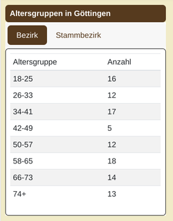
Auf der Statistikseite eines Bezirkes oder Bundeslandes gibt es nun eine Übersicht der Altersgruppen. Es kann zwischen Stammbezirk und Bezirk umgeschaltet werden. Ein "ungültiges(Invalid)" Alter liegt dabei vor ,wenn das Alter unter 18 oder über 100 Jahre ist. Ein "unbekanntes (unkown)" Alter liegt vor, wenn kein Geburtsdatum hinterlegt ist. (Referenz: !958 !1685) 

Die Anzeige der Forenliste wurde modernisiert und hat dabei auch ein paar Verbesserungen erhalten. Unter anderem gibt es in Forenthemen nun Direktlinks auf einzelne Beiträge. (Das kannst du probieren, indem du auf das Datum des Beitrags klickst.) 
Außerdem lässt sich das Forum nun auf kleinen Bildschirmen bzw. mobil besser nutzen. Auch das Nachladen von neuen Themen beim Scrollen an den unteren Bildschirmrand funktioniert nun besser. (Referenz: !1650 !1652)

Wenn du einen Post auf der Pinnwand eines Fairteilers schreibst, wirst du nicht mehr selbst per E-Mail benachrichtigt. (Referenz: !1638)

## Betriebsverantwortliche 
Dauerhaft geschlossene Betriebe können nun mit dem Status "Betrieb existiert nicht mehr" versehen werden. Sie werden dann auf der Karte nicht mehr angezeigt.  (Referenz: !1655)

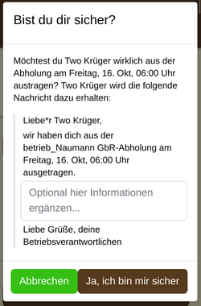
Wenn du als betriebsverantwortliche Person Foodsaver\*innen aus einem Abholtermin austrägst, versendest du jetzt automatisch eine Chatnachricht an diese Person. Du kannst direkt einen individuellen Text ergänzen und dort erklären, weshalb das Austragen erfolgt ist. (Referenz: !1677 !1703)

## Arbeitsgruppen und AG-Admins
Ähnlich wie die Begrüßungs-AG-Funktion kann nun in Bezirken auch eine AG zur Betreuung der Fairteiler hinterlegt werden. Deren Admins können zusätzlich zu den individuellen Fairteiler-Verantwortlichen die Fairteilerseite bearbeiten. (Referenz: !1667 !1679)

In den Suchfeldern für AG-Admins und -Mitglieder kannst du jetzt auch nach einer Kombination aus Vor- und Nachnamen sowie nach der konkreten FS-ID suchen. (Das ging bereits in Betrieben und Nachrichten, die Suchschnittstelle wurde angepasst.) (Referenz: !1588 !1624)

Wir haben einen Fehler behoben, der verhindert hat, in komplett leeren Arbeitsgruppen neue Mitglieder aufzunehmen. Auch AGs ohne verbliebenen Admin können nun wieder betreut werden. (Referenz: !1637)

Administratoren einiger AGs können nun außerdem Inhalte auf der Homepage bearbeiten: (Referenz: #967 !1651)
- Admins der AG "Öffentlichkeitsarbeit - Startseite" können die **Inhalte und Gestaltung der Startseite** anpassen.
- Admins der AG "Öffentlichkeitsarbeit - Partner" können die **Inhalte und Gestaltung der Partnerseite** anpassen.
- Admins der AG "Quiz" können alle Seiten, die für **das Quiz** relevant sind, über das interne CMS bearbeiten.

Wenn du ebenfalls für eine AG verantwortlich bist, für die es interessant sein könnte, bestimmte Inhalte auf diese Weise zu bearbeiten: Melde dich gern bei uns!

## BOTs und Orga
Orgamenschen können nun Essenskörbe ausblenden lassen, wenn sie gegen die Nutzungsbedingungen verstoßen. (Technisch werden diese Essenskörbe in die Vergangenheit verschoben.) (Referenz: !1670)

Beim Anlegen von mehreren Ausweisen wird nun für alle Ausweise das Aktualisierungsdatum korrekt hinterlegt. (Referenz: !1684)

foodsharing versendet eine große Menge an E-Mails. Das bemerkt ihr unter anderem daran, dass sie häufig ein paar Stunden brauchen, um zugestellt zu werden. Zur Reduktion dieser Menge werden neu registrierte Accounts testweise nicht mehr per Mail über neue Chatnachrichten benachrichtigt.  
In den Account-Einstellungen kann die Infomail zu neuen Chatnachrichten wie gewohnt aktiviert werden. Wir beobachten die Situation weiterhin. (Referenz: !1620)

---
## App

Für die Android-App und die iOS-Version gibt es aktuell leider keine größeren Neuerungen. Wenn du hier unterstützen willst, melde dich über unserem [Support-Formular](https://foodsharing.de/?page=content&sub=contact). (Oder komm direkt über [slackin.yunity.org](slackin.yunity.org) in den Kanal `#fs-dev-ios` oder `#fs-dev-android`.)

---

## Ausblick für die nächste Version

Wir haben eine Funktion in der Mache, mit der man Abstimmungen über die Homepage laufen lassen kann. Damit das möglichst fehlerfrei funktioniert, brauchen wir noch Menschen, die es testen. Kontaktiere dafür bitte unsere [beta-testing AG "Abstimmungen - Betatest"](https://foodsharing.de/?page=groups&p=392). 

> (Referenz: !1633 !1668 !1687 !1691)

---

## Danke für deine Aufmerksamkeit
Wir hoffen, die Veränderungen sind für dich eine Bereicherung.

Danke auch an die fleißigen Programmierer\*innen der IT, die das alles durch ehrenamtliche Arbeit ermöglicht haben! 

Wenn etwas unklar geblieben ist, schau gerne im [Changelog](https://foodsharing.de/?page=content&sub=changelog) nach und klickt auf die Ausrufezeichen (!) und Rauten (#), die du dort findest. Und wenn dann noch Fragen sind, frag gerne über unserem [Support-Formular](https://foodsharing.de/?page=content&sub=contact).

Falls dich interessiert, was in der letzten Zeit noch passiert ist: [Hier im Blog gibt es mehr von foodsharing](https://foodsharing.de/news#).

PS: Vielleicht bist ja du, werte lesende Person, ein\*e begeisterte\*r Nutzer\*in der App oder sogar ein\*e Programmierer\*in und/oder ein lernfähiger Mensch ohne Programmierkenntnisse mit etwas Zeit und dem Willen, sich einzubringen. 
Dann schau doch mal in unseren [Aufruf zur Mitarbeit](https://devdocs.foodsharing.network/it-tasks.html) und [Support-Formular](https://foodsharing.de/?page=content&sub=contact). Wir freuen uns, von dir zu hören.

Weiterhin frohes Retten!
Für das Team: Chris, Laura, Jonathan und Christian

---

## Release "Birne" (pear), August of 2020 - English, highly abridged Version:

The possibly two biggest changes (from a single FS' point of view):
**Please check if your phone number** is stored in your profile with the correct country code. We implemented a way to directly call numbers that are stored in the database like "+49 176 12345678".
Other ways to write the phone number are not auto-callable by the system. In those cases, copying the number into your clipboard and pasting it into the dialer app would a workaround. We've provided buttons to copy where possible!

As you have already read [in the BOT forum](https://foodsharing.de/?page=bezirk&bid=881&sub=forum&tid=107714): To lighten the BOT team workload, it is now possible to hand over the task of **greeting new food savers** to a local workgroup (AG). Administrators of that workgroup will then receive the appropriate rights and a bell notification upon new registrations.

If you feel the need for a better English version, [please contact us](https://foodsharing.de/?page=content&sub=contact). We'll be glad to regularly provide an English version as well, if you help us translate or proofread.

---

# Release "Birne" August 2020 

# foodsharing im Browser

Wir wurden gefragt: "**Warum heißt das (letzte) Release Apfelsine** - bedeutet das etwas?" Die Idee dahinter ist, dass ein schöner Name uns für die Arbeit motiviert und das Zählen der Versionen etwas heiterer macht. Dieses Release heißt "Birne", das nächste wird "Cranberry" heißen.

Wir wurden weiterhin gefragt: "**Wie kann ich am besten helfen**?" Dafür gibt es verschiedene AGs und Möglichkeiten wie unsere Hack-Events. (Das nächste ist übrigens schon bald: [21. bis 23. August 2020](https://codi.kanthaus.online/foodsharing-hackweek_August2020?both) )
Schreib uns bei Interesse einfach eine Nachricht über das [Support-Portal](https://foodsharing.de/?page=content&sub=contact), dann nehmen wir Kontakt mit dir auf. Du kannst diese Info auch gern an potentiell Interessierte weiterleiten!

Mit dem Release der neuen Software-Version sind weitere Funktionen verfügbar. Allerdings wirst du gar nicht alle Änderungen bemerken, auch wenn manche davon wirklich viel Arbeit gemacht haben.
Zum Beispiel sind wir Fehlermeldungen angegangen, haben den Software-Code modernisiert, Layout-Verbesserungen vorgenommen, Übersetzungen ermöglicht und vieles mehr.
All das fällt beim Benutzen seltener als eine neue Funktion, Instandhaltung macht die Seite jedoch stabiler und zukunftsfähig. Aktuell ist unser ehrenamtliches Team sehr ausgelastet und freut sich daher stets über Unterstützung!

Wir haben [Notizen im Changelog](https://foodsharing.de/?page=content&sub=changelog) gesichtet, diskutiert und formuliert. Nun haben wir bündig zusammengefasst, was sich für dich ändert, wenn du Foodsharer\*in oder Foodsaver\*in, BV oder BOT bist.

## Alle, die die Seite nutzen
Es gab verschiedene Schreibweisen für [Fairteiler](https://wiki.foodsharing.de/Fairteiler_und_Abgabestellen#.C3.9Cbrigens:_.22Fairteiler.22.2C_nicht_.22Fair-Teiler.22) im Quellcode. Die korrekte und offizielle **Schreibweise: Fairteiler**.
(Referenz: !1479)

Wenn du nicht als Nutzer\*in eingeloggt bist und einen Profillink beispielsweise über den auf Ausweisen aufgedruckten QR-Code aufrufst, erreichst du jetzt eine **Statusseite**, ob die entsprechende Person verifiziert ist.
(Referenz: !1604)

Es ist jetzt beim Login möglich, einen Cookie so zu hinterlegen, dass du auch bei einem Neustart des Browsers bei foodsharing **angemeldet bleibst**. Abgemeldet wirst du, wenn du mal 14 Tage lang die Seite nicht aufrufen solltest.
(Referenz: !1585) 

Wo früher "Oft gestellte Fragen" (**FAQ**) beantwortet wurden, findest du jetzt eine schicke neue Seite mit der gleichen Funktion: 
https://foodsharing.freshdesk.com   
Mit freshdesk können unsere Leute im Support euch noch besser unterstützen als bisher (hoffen wir 😁).  
#### Dort kannst du insbesondere:
* bekannte und bewährte Lösungen finden
* über das Formular Anfragen stellen und direkt Videos / Screenshots ergänzend hochladen
* dich selbst für den Support bewerben (wir freuen uns über Unterstützung!)
(Referenz: !1587)

In deinem Profil wird eine Warnung gezeigt, wenn unsere Mails deine private E-Mail-Adresse nicht mehr erreichen (d.h. wenn du auf der **"Bounce Liste"** von foodsharing gelandet sein solltest).
[Falls du besagte Warnung siehst, lies bitte diesen Artikel in Freshdesk](https://foodsharing.freshdesk.com/support/solutions/articles/77000299947-e-mail-sperre-im-profil). (Referenz: !1572) 

Wir haben das Verhalten von **Glocken-Benachrichtigungen** überarbeitet. Beispielsweise haben jetzt Fairteilerposts ein Icon, Betriebs-Glocken sehen nicht alle gleich aus, und das Anklicken einer Benachrichtigung "mit mittlerer Maustaste" (um sie in einem neuen Tab zu öffnen) ist nun möglich.
(Referenz: !1504, !1566, !1560, !1540) 

**Mails, die deinen Zugang zum Account betreffen**, zum Beispiel "Passwort vergessen" oder "E-Mail-Adresse ändern", werden jetzt schneller versendet als andere Benachrichtigungen.
(Referenz: !1557) 

## Foodsharer\*in und Foodsaver\*in

**Bitte prüf einmal, ob deine Rufnummer [im Profil](/?page=settings&sub=general) mit Ländervorwahl hinterlegt ist.**
Die Möglichkeit, jemanden direkt anzurufen, wird **nur mit korrekt hinterlegter Ländervorwahl** in Betriebslisten und Abhol-Slots angezeigt. Ansonsten muss der Text kopiert und in der Anruf-App eingefügt werden.
- **Richtig** ist beispielsweise: "+49 176 123 456 78" oder "+49 3371 123456" oder auch "+49(176)...". 
- *Nicht automatisch anrufbar* ist eine lokale Vorwahl wie beispielsweise die 0: "0176 123 456 78"
- **Nicht gültig** ist eine doppelte Vorwahl wie beispielsweise: "+49(0)176 123 456 78")

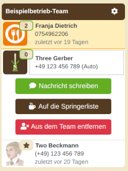
In **Teamlisten von Betrieben** hatten alle FS mit bestandenem Quiz für Botschafter\*innen (BOT-Quiz) einen orangenen Rahmen ums Profilbild. Diese Rahmen sind nun an der Stelle nicht mehr vorhanden, weil sie im Betriebs-Kontext eher Verwirrung erzeugt als geholfen haben.  
Wenn du deine Botschafter\*innen suchst, klickst du oben links auf Bezirke, wählst deinen Bezirk aus, klickst beispielsweise auf "Forum" - und da sind dann die aktiven BOTs aufgelistet, ohne ehemalige oder welche aus anderen Bezirken :)

Ebenfalls neu in der Betriebsliste: Die Profile der **Betriebsverantwortlichen** sind jetzt **oben fixiert**, farblich hervorgehoben und leichter zu finden. Das ersetzt die Box, die zuvor ganz unten platziert war.  
Außerdem haben wir zur besseren Erkennbarkeit die Profilbilder vergrößert. Ein Klick auf das Bild leitet dich nun direkt auf das Profil weiter.

Die Funktionen, die zuvor im **Drop-Down-Menü** zu finden waren, klappen jetzt übrigens nach Klick auf den Namen in einer Box auf.  
Hier sind die Änderungen an der Betriebs-Liste für Interessierte noch genauer beschrieben:
https://gitlab.com/foodsharing-dev/foodsharing-beta-testing/-/issues/14
(Referenz: !1499)

In der **Suchleiste** oben werden auch Arbeitsgruppen angezeigt. Wir haben beispielsweise verändert, dass dort unter "meine Arbeitsgruppen" diejenigen nicht mehr auftauchen, in denen du (noch) nicht aufgenommen wurdest.
Wir haben auch die Suchfunktion angepasst, die Ergebnisse werden jetzt besser gefiltert.
(Referenz: !1589, !1513)

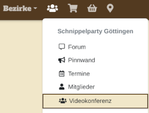
Übrigens: Du bist in einer Arbeitsgruppe und willst eine **Videokonferenz** starten? Das geht jetzt direkt mit BigBlueButton, einem Open-Source-Konferenztool. Klicke dazu oben auf "Deine Gruppen", den Gruppentitel, dann auf "Videokonferenz".
(Referenz: !1561)

Wir haben die "Funktion der Regelverletzung" auf der Profilseite und damit das **Meldesystem für Verstöße deaktiviert**. Nähere Informationen kannst Du im [Blogpost](https://foodsharing.de/?page=blog&sub=read&id=254) nachlesen. Eure BOTs oder lokalen Meldegruppen sollten euch darüber bereits informiert haben.
(Referenz: !1610)

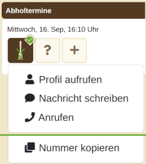
Wenn **unverifizierte FS** einem Team beitreten, konnten diese bislang die **Telefonnummern und das letzte Abholungs-Datum** von allen Leuten im Team einsehen. Das haben wir eingeschränkt und werden auch noch weiter daran arbeiten, um eine gute Balance zu finden. Aktuell sind die genannten Daten übrigens auch für Menschen auf der **Springerliste versteckt**, d.h. für alle, die sich nicht in Abholslots eintragen können.  
Wenn es, liebe\*r Betriebsverantwortliche\*r, für Abläufe in deinem Betrieb wichtig ist, dass unverifizierte Leute einige Nummern sehen können: nutze bitte zur Kommunikation die Pinnwand (können Unverifizierte lesen, Springer nicht) oder die Betriebsbeschreibung (können sowohl Springer wie auch Unverifizierte lesen). Bei Betrieben, in denen beispielsweise Einführungen angeboten werden, sind Pinnwand-Einträge mit der Kontakt-Info empfehlenswert.
(Referenz: !1591)

Eine häufig nachgefragte Funktion haben wir in dem Zug auch noch umgesetzt: Wenn du für kurzfristige Informationen zu einer Abholung die eingetragenen Personen anrufen möchtest, kannst du deren Telefonnummer jetzt direkt im Dropdown des Abholslots entweder anrufen oder kopieren. Ein Suchen in der Teamliste entfällt damit.
(Referenz: !1591)

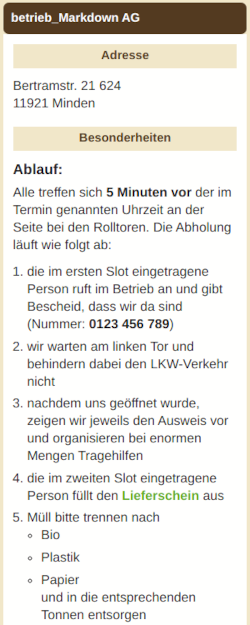
## Betriebsverantwortliche 
In der **Betriebsbeschreibung** sind nun Formatierungen per [Markdown-Syntax](https://markdown.de/) möglich: Du kannst beispielsweise Hyperlinks einbauen, Überschriften hervorheben, Text fett/kursiv machen und Aufzählungspunkte oder Linien nutzen.
(Referenz: !1520)

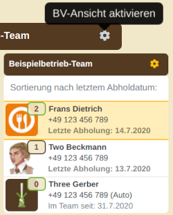
Mit dem neuen Zahnrad-Button an der Teamübersicht können BVs nun das Team nach der letzten Abholung sortieren, um so einen schnellen Überblick der aktiven Foodsaver des Betriebs zu haben. Das genaue Datum ist auch in der Standard-Ansicht weiterhin einsehbar, dazu einfach die Maus über den Namen bewegen.
(Referenz: !1593)

Wenn du oben auf die Liste deiner aktiv kooperierenden Betriebe (**Einkaufswagen-Icon**) klickst, stehen jetzt diejenigen Betriebe ganz oben, für die du verantwortlich bist. Das liegt vor allem daran, dass für diese Betriebe die Ampelfunktion besonders häufig benötigt wird. Alle "Deine" Betriebe haben zur Kennzeichnung ein Zahnrad hinter dem Betriebsnamen.
(Referenz: !1546)

Wir sind außerdem dabei, die Funktion zum **Hochladen von Bildern** zu modernisieren. Bereits umgesetzt ist der neue Upload **für Fairteiler** und wird nun einige Zeit dafür getestet. Das bedeutet: foodsharing kann jetzt auch mit z. B. gedrehten Bildern umgehen, den Ausschnitt besser markieren etc.  
Bis die moderne Variante jedoch für alle Bilder umgesetzt werden kann, ist es noch ein langer Weg - [wir freuen uns über Unterstützung!](https://foodsharing.de/?page=content&sub=contact)
(Referenz: !818)

## Botschafter\*innen
Wie ihr bereits [im BOT-Forum](https://foodsharing.de/?page=bezirk&bid=881&sub=forum&tid=107714) gelesen habt: Um das BOT-Team zu entlasten, ist es jetzt möglich, die **Begrüßung neuer Foodsaver\*innen** an eine lokale AG abzugeben. Wenn die AG eingerichtet ist, erhalten nur die Admins dieser AG (nicht mehr alle BOTs) bei Neuanmeldungen jeweils die Glocken-Benachrichtigung.
(Referenz: !1612, !1544)

## AG-Admins, BOTs und Orga
Vielleicht ist dir aufgefallen, dass in deiner Mailbox manche Mailadressen falsch angezeigt wurden, wenn sie ungelesene Nachrichten enthalten. Wir haben dieses Verhalten korrigiert und E-Mail-Adressen in AG-Postfächern werden nun hoffentlich wieder alle korrekt angezeigt.
(Referenz: !1600)

---
## App

Für die Android-App und für die iOS-Version gibt es aktuell leider keine größeren Neuerungen. Wenn du hier unterstützen willst, melde dich über unserem [Support-Formular](https://foodsharing.de/?page=content&sub=contact). (Oder komm direkt über [slackin.yunity.org](slackin.yunity.org) in den Kanal `#fs-dev-ios` oder `#fs-dev-android`.)

---

## Danke für deine Aufmerksamkeit
Wir hoffen, die Veränderungen sind für dich eine Bereicherung.

Danke an die fleißigen Programmierer\*innen der IT, die das alles durch ehrenamtliche Arbeit ermöglicht haben! 

Wenn etwas unklar geblieben ist, schau gerne im [Changelog](https://foodsharing.de/?page=content&sub=changelog) nach und klickt auf die Ausrufezeichen (!) und Rauten (#), die du dort findest. Und wenn dann noch Fragen sind, frag gerne über unserem [Support-Formular](https://foodsharing.de/?page=content&sub=contact).

Wenn dich interessiert, was in der letzten Zeit noch passiert ist: [Hier gibt es mehr von foodsharing](https://foodsharing.de/news#).

PS: Vielleicht bist ja du, werte lesende Person, ein\*e begeisterte\*r Nutzer\*in der App oder sogar ein\*e Programmierer\*in und/oder ein lernfähiger Mensch ohne Programmierkenntnisse mit etwas Zeit und dem Willen, sich einzubringen. 
Dann schau doch mal in unseren [Aufruf zur Mitarbeit](https://devdocs.foodsharing.network/it-tasks.html) und [Support-Formular](https://foodsharing.de/?page=content&sub=contact). Wir freuen uns, von dir zu hören.

Weiterhin frohes Retten!
Für das Team: Laura, Jonathan und Christian

---

# Release Apfelsine Mai 2020 

# foodsharing im Browser

Mit dem Release der neuen Software-Version sind weitere Funktionen verfügbar. Allerdings wirst du gar nicht alle Änderungen merken, auch wenn einige wirklich viel Arbeit gemacht haben. Zum Beispiel sind wir Fehlermeldungen angegangen, 
haben den Software-Code modernisiert und Layout-Verbesserungen vorgenommen. Im Changelog findest du viele Einträge, die 'refactoring' oder 'bugfixing' betreiben, und relativ wenig neue Features/Funktionen - Das ist der aktuelle Weg der aktiven Programmierer\*innen, um das Arbeiten an der Seite für neue Menschen attraktiv zu machen. Aktuell ist unser ehrenamtliches Team sehr ausgelastet und freut sich stets über Unterstützung. Wenn es eine neue Funktion gibt, die du gerne programmiert sehen willst, ist es am besten, du findest selbst Entwickler\*innen, die Lust haben, dieses zu implementieren.

Die großen Herausforderungen seit dem letzten Release waren die Karte (wo wir einen neuen Kartenserver finden mussten, was in der Größe von foodsharing nicht so einfach ist) und die Anzahl der Mails, die durch die Seite 
verschickt wurden (es sind sehr, sehr viele - unser Mailhoster hat dankenswerterweise mit uns eine Übergangslösung gefunden, bis wir wieder weniger E-Mails pro Minute verschicken).
Die Ausarbeitung hat viel Zeit und Energie gekostet. Wir hoffen, dass wir uns jetzt wieder auf schönere Themen konzentrieren können. 😁

Wir haben [Notizen im Changelog](https://foodsharing.de/?page=content&sub=changelog) gesichtet, diskutiert und formuliert. Nun haben wir bündig zusammengefasst, was sich für dich ändert, 
wenn du Foodsharer\*in oder Foodsaver\*in, BV oder BOT bist.

Die Release Notes haben jetzt einen eigenen Ort. Du findest sie oben beim Informations-i unter dem Begriff "Was ist neu?" (Referenz !1474)

## Foodsharer\*in und Foodsaver\*in

Das Registrierungsformular für neue Foodsharer\*innen wurde vollständig neu entwickelt. Da wir beim Beheben von Fehlern mit alten Technologien immer wieder an Grenzen gestoßen sind, wurde das Formular in eine Mehr-Seiten-Variante mit aktueller Technologie (vue js) neu programmiert.
Dabei haben wir an den wichtigen Stellen, umfangreiche Überprüfungen der Eingaben eingebaut. Die Eingabe vom Geburtsdatum funktioniert jetzt deutlich einfacher. Für die Eingabe einer optionalen Handynummer wurde eine Funktion zur Auswahl des Ländercodes eingebaut.
Die Eingabe der Adresse oder das Hochladen vom Profil-Foto haben wir nicht eingebaut, da es freiwillig ist und auch später in den Einstellungen nachgeholt werden kann.
(Referenz: !1401 )

Wir sind zu einem anderen Kartenanbieter (Geoapify) gewechselt. Die Gelegenheit haben wir genutzt, um die Kartendarstellung auf eine modernere Technologie umzustellen, wodurch die Karte jetzt mit deutlich höherer Auflösung dargestellt wird.
(Referenz: !1405 !1355 )

Wenn du neu bei foodsharing bist und das Quiz bereits bestanden hast, aber du noch keinen Stammbezirk gewählt hast, bekommst du einen Hinweis und wirst zur Bezirksauswahl umgeleitet. 
(Referenz: !1123 )

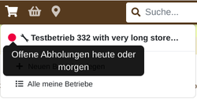
* Eine der deutlichsten Änderungen in diesem Release betrifft Foodsaver\*innen und BVs. Wenn man das Symbol der Betriebsliste oben (beim Einkaufswagen-Symbol) anwählt, wird jetzt angezeigt, wenn Handlungsbedarf besteht. Es gibt ein rotes Ampellicht, wenn es heute oder morgen freie Slots gibt; ein oranges Licht für leere Slots in ‘heute+1’ bis ‘heute+3’ Tagen und ein gelbes Licht für leere Slots in ‘heute+3’ bis ‘heute+5’ Tagen.
Beispiel: Der nächste zu füllende Slot ist in 4 Tagen. Dann wird ein gelbes Warnlicht angezeigt – es sei denn, du hast bereits einen Slot aus der Reihe übernommen. Dann wird dieses Datum für deine Warnampel nicht berücksichtigt.
Wenn in der näheren Zeit keine freien Slots übrig sind, gibt es auch keine Ampel-Anzeige. :-)
Die ampelfarbenen Marker werden auch erklärt, wenn man mit der Maus über das Ampelsymbol fährt.
(Referenz: !1106 !1133 !1331 !1502)

Du kannst jetzt auf dem Dashboard nach Betriebsupdates, E-Mails etc. filtern. Dazu sind die neuen Icons da.
(Referenz: !735)

Du kannst jetzt einstellen, dass du für Chat-Nachrichten Push-Benachrichtigungen über den Browser (auch auf dem Smartphone) erhältst. Diese aktivierst du über die Einstellungen oder die Infobox auf dem Dashboard. (Referenz: !734 !1444 )

Benutzer\*innen, die sich sechs Monate lang nicht eingeloggt haben, kriegen keine E-Mails mehr über Forumsbeiträge. Das heißt, wir sparen hier etwas E-Mails und du bekommst weniger automatische Mails, wenn du gerade inaktiv bist. (Referenz: !1385 )

Außerdem haben wir ein neues Feld "Kurzbeschreibung" auf dem Profil eingefügt. Hier kannst Du dich (nur für angemeldeten Benutzer sichtbar) selbst beschreiben.
(Referenz: !1145 )

Wenn du dich für eine Arbeitsgruppe oder einen Bezirk bewirbst und abgelehnt wirst, kannst du dich danach erneut bewerben. (Abgelehnte Anträge werden nun gelöscht. Referenz: !1277 )

Auf dem Handy (Browserversion) war es eine Zeit lang nicht möglich, Betrieben mit langen Beschreibungen beizutreten. Das ist jetzt gelöst.
(Referenz: !1378 )

Auch das Problem, dass Untermenüs des Burgermenüs in der mobilen Version (Browserversion) nicht vollständig lesbar waren, ist nun behoben. 
(Referenz: !1411 )

Auf dem Handy (Browserversion) werden jetzt die letzte Abholung und der letzte Teambeitritt auf der Teamliste angezeigt.
(Referenz: !1335 )

Wenn die interne Adresse einer empfangenen E-Mail nicht gefunden werden kann, wird die Mail nicht mehr in 'lost@foodsharing' einsortiert. Stattdessen wird eine automatische Antwort gesendet, die besagt, dass die Adresse nicht gefunden werden konnte.

Der Text dieser Email ist noch etwas kurz und könnte durch etwas Schöneres ersetzt werden. Jede Idee ist willkommen :)
(Referenz: !1346 )

Aus deiner foodsharing-Mailbox können Mails nun auch mit Leerzeichen versendet werden. Das heißt, es macht für den Versand nichts mehr aus, wenn eine Mailadresse versehentlich mit Leerzeichen eingetragen wird.
(Referenz: !1372 )

Wir haben die [Statistik-Seite](https://foodsharing.de/statistik) um Informationen erweitert. (Referenz: !1351 )

Wir haben einen grafischen Fehler behoben, durch den zum Beispiel Links in der Betriebsbeschreibung über den Seitenrand hinausreichten. (Referenz: !1269 )

Die Darstellung vom Dashboard wurde für Smartphones oder kleine Bildschirme verbessert. (Referenz: !1494) 

Nur als Info: Es kam ab und zu vor, dass Foodsaver\*innen ihre Accounts gelöscht haben, als sie die Datenschutzrichtlinie akzeptiert haben. Daher wurden nun die Farbe und die Formulierung angepasst, sodass klarer ist, dass bei Ablehnung der Richtlinie der Account gelöscht wird.
(Referenz: !1318)

## Betriebsverantwortliche 

Wir haben neben vielen kleinen Fehlern einen großen ausgemerzt, bei dem Mailboxen nicht erstellt wurden.
Die beeinträchtigten FS können jetzt auch wieder Visitenkarten erstellen. (Referenz: !1356 )

Deine persönliche foodsharing-Mailadresse siehst du nun auf deinem Profil. Die Mailadresse ist nur für dich und Personen mit Orga-Rechten sichtbar.(Referenz: !1387 )

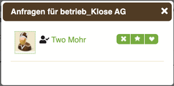
Visitenkarten mit langen Bezirksnamen werden jetzt auch wieder korrekt erstellt. (Referenz: !1362 )

Bewerben sich FS als Abholer\*innen in einem Betrieb, siehst du nun an einem neuen Symbol, ob die Person bereits verifiziert ist. (Referenz: !1294 )

Der Button zum Anlegen neuer Betriebe passt jetzt besser ins Design. (Referenz: !1282 !1339 )

## Botschafter\*innen

Bisher wurden bei ausgehenden Mails keine Zeilenumbrüche angezeigt. Dies ist jetzt behoben. (Referenz: !1317 !1344 )

In der Liste bei der Ausweiserstellung sind die Namen der Foodsaver\*innen nun alphabetisch pro Bezirk sortiert. Die Auflistung der AGs wurde entfernt.  (Referenz: !1310)

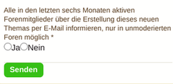
Als BOT kannst du jetzt bei unmoderierten Foren wie dem Europaforum auswählen, ob alle in der Region und damit im Forum per Mail über neue Beiträge informiert werden sollen. 
Das sollte unsere Maillast etwas verringern. (Referenz: !1233)

## AG-Admins und Orga
Es ist jetzt wieder möglich, Blog-Beiträge zu veröffentlichen, zu bearbeiten und zu löschen. (Referenz: !1349 )

## Orga

Personen mit Orga-Rechten können nun die Rollen anderer Benutzer\*innen ändern. (Referenz: !1322 !1323 )

Beiträge auf Fairteiler-Pinnwänden können jetzt gelöscht werden. Admins der Arbeitsgruppen können wieder die Wall für Bewerber sehen. (Referenz: !1359 )

---
## App

Die folgenden Änderungen gelten für die Android-App. Leider gibt es aktuell keine Neuerungen für die iOS-Version. Wenn du hier unterstützen willst, melde dich unter [it@foodsharing.network](mailto:it@foodsharing.network?subject=IOS-Ich-will-helfen). (Oder komm direkt über [slackin.yunity.org](slackin.yunity.org) in den Kanal `#fs-dev-ios`.)

#### Was ist neu?
Du kannst nun auch Text von jeder anderen App über foodsharing teilen. Diese Funktion kannst du ganz einfach nutzen, wenn du über "Teilen" die foodsharing-App auswählst. (Referenz: android!195)

Die Pinnwände von Fairteilern werden jetzt auch in der App angezeigt und du kannst mit der App neue Einträge erstellen. Leider ist es momentan noch nicht möglich neue Bilder über die App hochzuladen, aber das schaffen wir bestimmt bis zum nächsten Release. (Referenz: android!193)

Wenn du einen Essenskorb erstellt hast, kannst du das Foto auch später jederzeit ändern. Dabei kannst du entscheiden, ob du ein Foto aus deiner Galerie wählen oder ein neues machen möchtest. Essenskörbe werden in der Liste jetzt mit Foto dargestellt. 
  Das Design der Essenskörbe ist nun angepasst an die Website. Das heißt, die aktuelle Anzahl der Anfragen wird angezeigt, du kannst eine Anfrage für den Essenskorb stellen, deine bisherige Anfrage zurückziehen oder eine Nachricht an den/die Ersteller\*in schreiben.
  Wenn du der Standortbestimmung durch die App zustimmst, wird dir auch die Distanz zum Essenskorb angezeigt. Auch die Gruppierung der Icons wurde optimiert, damit es nicht mehr zu Icon-Überschneidungen kommt.
(Referenz: android!181 android!182 android!177 android!180 android!179 android!183 android!190 )
  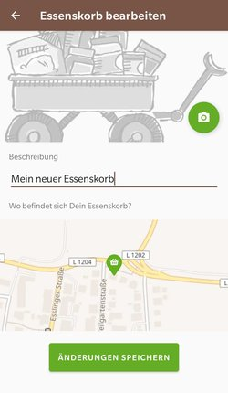
  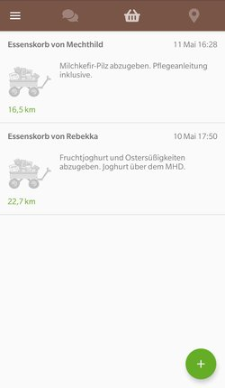
  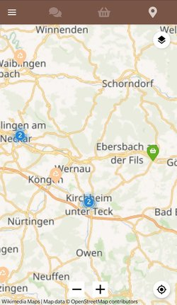

Die Status-Updates werden jetzt in den Profilen angezeigt und du kannst in deinem Profil ein neues Status-Update posten.

Im Burgermenü der App gibt es jetzt einen direkten Link zur Website, damit du schnell hin und her springen kannst. 
Außerdem kannst du nun ebenfalls über das Burgermenü die foodsharing-App mit nur einem Klick weiterempfehlen. (Referenz: android!198 android!199 android!185)
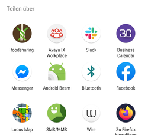

#### Behobene Fehler
* Vermutlich ist dir schon aufgefallen, dass du schnell wieder aus der App ausgeloggt wirst. Wir haben hier ein paar Optimierungen vorgenommen, sodass dies nicht mehr passieren sollte (Referenz: !1496)
* Wir haben den Bug behoben, dass eine Nachricht erst nach dem Neuladen der Seite als gelesen markiert wird. (Referenz: android!192)
* Die Karte sollte jetzt nicht mehr im Meer bei Afrika an der N 0.0 E 0.0 Koordiante zentriert sein. (Referenz: android!211)

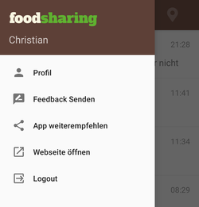

---

## Danke für deine Aufmerksamkeit
Wir hoffen, die Veränderungen sind für dich eine Bereicherung.

Danke an die fleißigen Programmierer\*innen der IT, die das alles durch ehrenamtliche Arbeit ermöglicht haben! 

Wenn etwas unklar geblieben ist, schau gerne im [Changelog](https://foodsharing.de/?page=content&sub=changelog) nach und klickt auf die Ausrufezeichen (!) und Rauten (#), die du dort findest. Und wenn dann noch Fragen sind, frag gerne [it@foodsharing.network](mailto:it@foodsharing.network?subject=Frage-zu-Release-Notes).

Wenn dich interessiert, was in der letzten Zeit noch passiert ist: [Hier gibt es mehr von foodsharing](https://foodsharing.de/news#).

PS: Vielleicht bist ja du, werte lesende Person, ein\*e begeisterte\*r Nutzer\*in der App oder sogar ein\*e Programmierer\*in und/oder ein lernfähiger Mensch ohne Programmierkenntnisse mit etwas Zeit und dem Willen, sich einzubringen. 
Dann schau doch mal in unseren [Aufruf zur Mitarbeit](https://devdocs.foodsharing.network/it-tasks.html) und [melde dich bei uns](mailto:it@foodsharing.network?subject=Ich-will-helfen). Wir freuen uns, von dir zu hören.

Weiterhin frohes Retten!
Für das Team: Laura, Jonathan und Christian
